# Turkey

> 카카오 T 퀵의 사용자 흐름을 참고한 실시간 퀵배송 서비스

**Softeer Bootcamp 8기 Team 7 종합 프로젝트**

 

## 🚚 서비스 소개

Turkey는 물품을 빠르게 배송하려는 고객과 주변 라이더를 실시간으로 연결하는 웹 기반 퀵서비스 플랫폼입니다.

 **고객 배송요청 → 배차 → 실시간 위치 추적 → 배송 완료**로 이어지는 핵심 흐름을 제대로 구현하고, 그 과정에서 마주치는 기술적 도전에 집중하는 것을 목표로 삼았습니다.

- 🔗 [배포 링크](https://dw1nqa61d1no6.cloudfront.net/)

- 📑 [API 문서 (Swagger)](https://dw1nqa61d1no6.cloudfront.net/swagger-ui/index.html#/)

 

## 🎬 시연 영상

> 시연 영상 추가 예정

<!-- 예:  -->

 

# Turkey 사용자 흐름도

고객과 라이더가 각자 화면을 거치며 하나의 배송이 완성되기까지의 경로입니다.

 

## 1. 전체 흐름

| 표기 | 뜻 |
| --- | --- |
| 🟦 파란 노드 | 고객 · 웹 브라우저 |
| 🟨 노란 노드 | 라이더 · 안드로이드 앱 |
| 🔴 빨간 화살표 | 두 액터가 서버를 통해 서로를 움직이는 지점 |
| 🟠 주황 화살표 | 고객이 흐름에서 빠져나가는 분기(취소) |
| 굵은 테두리 | **클릭하면 그 지점의 의사결정 기록(ADR)으로 이동** |

```mermaid
flowchart LR
    C1["🧑 ① 회원가입<br>/customer/signup"] --> C2["🧑 ② 로그인<br>/customer/login"] --> C3["🧑 ③ 포인트 충전<br>/points/charge"] --> C4["🧑 ④ 배송요청 생성<br>/deliveries/new"] --> C5["🧑 ⑤ 실시간 위치 추적<br>/deliveries/$id/tracking"]
    C5 --> C6["🧑 ⑥ 포인트 내역<br>/points"]
    C5 --> C7["🧑 ⑦ 배송 내역<br>/deliveries"]
    C5 -->|"WAITING 중에만 '주문취소'"| C8["🧑 ⑧ 취소 · 포인트 환급<br>WAITING → CANCELED"]

    R1["🛵 ① 회원가입<br>/rider/signup"] --> R2["🛵 ② 로그인<br>/rider/login"] --> R3["🛵 ③ 콜 받기<br>UNAVAILABLE → AVAILABLE"] --> R4["🛵 ④ 콜 목록<br>/requests"] --> R5["🛵 ⑤ 수락 · 배차<br>AVAILABLE → BUSY"] --> R6["🛵 ⑥ 진행 배송<br>픽업 → 인수 → 배송"] --> R7["🛵 ⑦ 완료 인증<br>BUSY → AVAILABLE"]
    R7 --> R8["🛵 ⑧ 포인트 · 정산<br>/points"]
    R7 --> R9["🛵 ⑨ 운행 기록<br>/history"]

    C4 -->|"WAITING 주문이 콜 목록에 뜬다"| R4
    R5 -->|"배차 확정 · '라이더가 배정됐어요'"| C5
    R6 -->|"위치 POST → Redis Pub/Sub → SSE"| C5
    R7 -->|"COMPLETED · 운임 확정 · 정산 생성"| C7

    click C2 href "https://github.com/softeerbootcamp-8th/WEB-Team7-Turkey/wiki/ADR‐002-Redis-사용" "ADR-002 · 세션을 Redis에 저장"
    click C3 href "https://github.com/softeerbootcamp-8th/WEB-Team7-Turkey/wiki/TBD-포인트-충전-결제" "TBD · 포인트 충전 / PG 파사드"
    click C4 href "https://github.com/softeerbootcamp-8th/WEB-Team7-Turkey/wiki/TBD-주문-생성과-포인트-차감" "TBD · 요금 대조 + 포인트 차감 단일 트랜잭션"
    click C5 href "https://github.com/softeerbootcamp-8th/WEB-Team7-Turkey/wiki/ADR‐010:-위치-전달-방식(SSE)-부하테스트-검증" "ADR-010 · SSE vs Polling"
    click R3 href "https://github.com/softeerbootcamp-8th/WEB-Team7-Turkey/wiki/ADR‐003-라이더-상태와-배송-상태-분리" "ADR-003 · 라이더 상태와 배송 상태 분리"
    click R4 href "https://github.com/softeerbootcamp-8th/WEB-Team7-Turkey/wiki/TBD-배차-위치-검색-방향" "TBD · 주문 GEO 인덱싱 vs MySQL 쿼리"
    click R5 href "https://github.com/softeerbootcamp-8th/WEB-Team7-Turkey/wiki/ADR‐006-배차-동시성-처리" "ADR-006 · 조건부 UPDATE(CAS)"
    click R6 href "https://github.com/softeerbootcamp-8th/WEB-Team7-Turkey/wiki/ADR‐010:-위치-전달-방식(SSE)-부하테스트-검증" "ADR-010 · 위치 전송 · SSE 팬아웃"
    click R7 href "https://github.com/softeerbootcamp-8th/WEB-Team7-Turkey/wiki/TBD-배송-완료와-정산" "TBD · 완료 인증 + 정산 생성 트랜잭션"
    click C8 href "https://github.com/softeerbootcamp-8th/WEB-Team7-Turkey/wiki/TBD-고객-취소와-환급" "TBD · 취소=환급, 배차 전에만 허용"

    classDef cus fill:#dbeafe,stroke:#3b82f6,color:#1e3a5f
    classDef rid fill:#fef3c7,stroke:#f59e0b,color:#5c4813
    classDef adr stroke-width:3px
    class C1,C2,C3,C4,C5,C6,C7,C8 cus
    class R1,R2,R3,R4,R5,R6,R7,R8,R9 rid
    class C2,C3,C4,C5,C8,R3,R4,R5,R6,R7 adr
    linkStyle 15,16,17,18 stroke:#dc2626,stroke-width:3px
    linkStyle 6 stroke:#ea580c,stroke-width:3px
```

 

## 👥 팀원 소개 및 맡은 일

| 이름 | 담당 도메인 |
| --- | --- |
| [정상진](https://github.com/jsj3473) | 위치·실시간 통신, 인증 |
| [백홍빈](https://github.com/githings) | 고객 서비스, 결제·정산, 웹앱 |
| [유승종](https://github.com/bigbell999) | 위치·실시간 통신, AWS 인프라 |
| [박민서](https://github.com/minseo6753) | 배차 동시성, 라이더 서비스, AWS 인프라 |
| [주민석](https://github.com/emes-g) | 배차 동시성, 라이더 서비스, AWS 인프라 |

 

## 🏗️ 인프라 아키텍처

 

## 🛠️ 기술 스택

| 분류 | 기술 스택 |
| --- | --- |
| 프론트엔드 |          |
| 백엔드 |         |
| 인프라 |      |
| 협업 |    |

 
