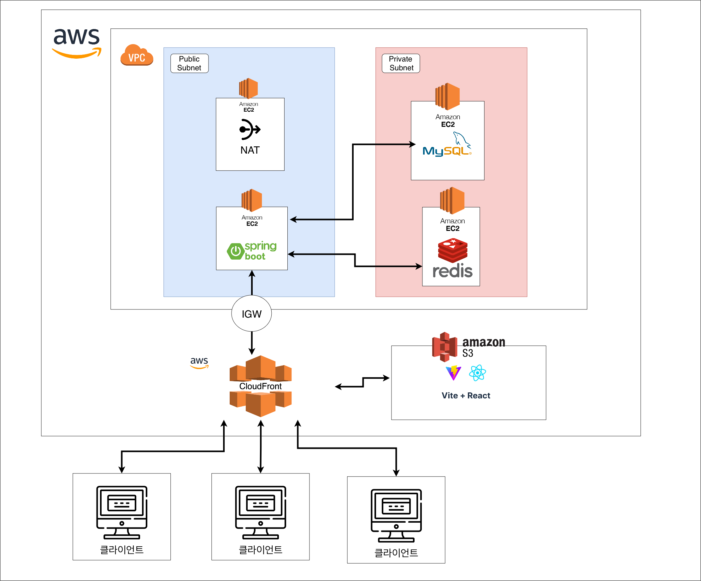

# Turkey

> 카카오 T 퀵의 사용자 흐름을 참고한 실시간 퀵배송 매칭 서비스

**Softeer Bootcamp 8기 Team 7 종합 프로젝트**

<br>

## 🚚 프로젝트 소개

Turkey는 물품을 빠르게 배송하려는 고객과 주변 라이더를 실시간으로 연결하는 웹 기반 퀵서비스 플랫폼입니다.

고객은 출발지와 도착지를 입력해 배송을 요청하고, 라이더는 주변 배송 요청을 확인한 뒤 원하는 요청을 수락할 수 있습니다.

주문 생성부터 배차, 라이더 위치 추적, 배송 완료 및 정산까지 퀵서비스의 핵심 흐름을 구현합니다.

<br>

## 🎯 프로젝트 목표

* 위치 기반 주변 라이더 검색
* 동시 배송 수락 상황에서 중복 배차 방지
* 라이더 위치의 실시간 수집 및 전달
* 안전한 배송 상태 전이 관리
* 배송 완료와 라이더 정산의 트랜잭션 처리
* 네트워크 단절 및 장애 상황을 고려한 배송 흐름 설계

<br>

## 서비스 아키텍처


<br>

## 📌 주요 기능

### 고객

* 출발지와 도착지를 기반으로 배송 요청
* 예상 거리와 배송 요금 확인
* 배차 진행 상태 확인
* 배정된 라이더 정보 확인
* 라이더 위치와 배송 상태 실시간 조회
* 배송 완료 증빙 및 배송 내역 확인

### 라이더

* 대기 상태 활성화 및 현재 위치 공유
* 주변 배송 요청 조회
* 배송 요청 상세 정보 확인 및 수락
* 픽업지 이동 및 물품 수령 처리
* 배송 중 실시간 위치 전송
* 배송 완료 사진 등록
* 배송 수익 및 정산 내역 조회

<br>

## 🔄 서비스 흐름

```text
고객 배송 요청
    ↓
주변 대기 라이더 검색
    ↓
라이더 호출
    ↓
배차 수락 경쟁
    ↓
라이더 한 명 배정
    ↓
픽업지 이동
    ↓
물품 수령
    ↓
실시간 배송 위치 추적
    ↓
배송 완료
    ↓
결제 및 라이더 정산
```

<br>

## 🧭 배송 상태

```text
배차 대기
    ↓
라이더 배정
    ↓
픽업지 이동
    ↓
물품 수령
    ↓
배송 중
    ↓
배송 완료
```

배송 상태는 정해진 순서에 따라 변경됩니다.

잘못된 상태 전이, 중복 요청, 권한이 없는 사용자의 상태 변경은 도메인 검증을 통해 차단합니다.

<br>

## 🔥 핵심 기술 과제

### 배차 동시성 제어

하나의 배송 요청을 여러 라이더가 동시에 수락하더라도 단 한 명의 라이더만 배차에 성공하도록 처리합니다.

조건부 업데이트, 낙관적 락 또는 비관적 락을 비교하고 프로젝트 상황에 적합한 방식을 적용합니다.

### 위치 기반 라이더 검색

고객의 픽업 위치를 기준으로 일정 반경 안에 있는 대기 라이더를 조회합니다.

Redis GEO 또는 공간 인덱스를 활용해 가까운 라이더를 거리순으로 검색합니다.

### 실시간 위치 추적

라이더의 현재 위치를 주기적으로 서버에 전달하고, 해당 배송을 기다리는 고객에게 실시간으로 전송합니다.

```text
라이더 → 서버: HTTP 또는 WebSocket
서버 → 고객: SSE 또는 WebSocket
```

### 배송 상태 정합성

배송 상태와 요청 사용자의 권한을 함께 검증합니다.

동시에 여러 상태 변경 요청이 발생해도 상태가 역행하거나 중간 단계를 건너뛰지 않도록 제어합니다.

### 결제 및 정산 트랜잭션

배송 완료 시 다음 작업을 하나의 트랜잭션으로 처리합니다.

* 배송 완료 처리
* 고객 결제 금액 확정
* 플랫폼 수수료 계산
* 라이더 수익금 적립
* 정산 내역 생성

자세한 구현 과정은 [핵심 기술 과제 문서](./docs/technical-challenges.md)에서 확인할 수 있습니다.

<br>

## 🖥️ 서비스 화면

### 배송 요청

<!-- 이미지 추가 후 주석을 제거합니다. -->

<!--  -->

### 배차 대기

<!--  -->

### 라이더 콜 수신

<!--  -->

### 실시간 배송 추적

<!--  -->

### 배송 완료

<!--  -->

<br>

## 🏗️ 시스템 아키텍처

<!-- 이미지 추가 후 주석을 제거합니다. -->

<!--  -->

```text
Customer Web
Rider Web
    ↓
Nginx
    ↓
Spring Boot Application
├─ Delivery
├─ Matching
├─ Rider Location
├─ Notification
├─ Payment
└─ Settlement
    ↓
MySQL
Redis
Object Storage
External Map API
```

<br>

## 🛠️ 기술 스택

### Frontend

* TypeScript
* React
* Next.js
* Tailwind CSS
* TanStack Query
* Storybook
* Vitest

### Backend

* Java 21
* Spring Boot
* Spring Data JPA
* MySQL
* Redis
* Flyway
* JUnit 5
* AssertJ
* Testcontainers
* Server-Sent Events
* WebSocket

> 프로젝트 요구사항에 따라 Spring Security는 사용하지 않고 인증과 인가에 필요한 기능을 직접 구현합니다.

### Infrastructure

* AWS EC2
* AWS S3
* Docker
* Nginx
* GitHub Actions

### Monitoring

* Spring Boot Actuator
* Prometheus
* Grafana

<br>

## 📅 프로젝트 일정

| Phase               | 목표                | 기간                        | 문서                   |
| ------------------- | ----------------- | ------------------------- | -------------------- |
| Phase 1. MVP        | 핵심 배송 흐름 구현       | `YYYY.MM.DD ~ YYYY.MM.DD` | [Notion](링크를-입력해주세요) |
| Phase 2. Deep Dive  | 동시성·실시간 위치·정산 고도화 | `YYYY.MM.DD ~ YYYY.MM.DD` | [Notion](링크를-입력해주세요) |
| Phase 3. 최적화 및 리팩터링 | 성능, 안정성, 테스트 개선   | `YYYY.MM.DD ~ YYYY.MM.DD` | [Notion](링크를-입력해주세요) |

<br>

## 📚 상세 문서

* [서비스 기획서](https://github.com/softeerbootcamp-8th/WEB-Team7-Turkey/discussions/180)
* [Frontend README](./frontend/README.md)
* [Backend README](frontend/README.md)
* [API 명세](링크를-입력해주세요)
* [ERD](링크를-입력해주세요)
* [시스템 아키텍처](./docs/architecture.md)
* [핵심 기술 과제](./docs/technical-challenges.md)
* [협업 규칙 및 컨벤션](./docs/conventions.md)

<br>

## 🤝 협업 방식

* GitHub Issue를 기준으로 작업을 관리합니다.
* 기능 개발 전에 API와 데이터 모델을 합의합니다.
* 모든 변경 사항은 Pull Request를 통해 병합합니다.
* 최소 한 명 이상의 코드 리뷰를 받은 후 병합합니다.
* 매일 데일리 스크럼을 진행합니다.
* 중요한 기술 결정은 문서로 기록합니다.

### 협업 기록

* [회의록](링크를-입력해주세요)
* [데일리 스크럼](링크를-입력해주세요)
* [페어 프로그래밍 기록](링크를-입력해주세요)
* [KPT 회고](링크를-입력해주세요)
* [기술 의사결정 기록](링크를-입력해주세요)

브랜치, 커밋, Pull Request 규칙은 [협업 규칙 및 컨벤션](./docs/conventions.md)에서 확인할 수 있습니다.

<br>

## 👥 팀원

| 이름   | 역할       | GitHub       | 담당        |
| ---- | -------- | ------------ | --------- |
| 팀원 1 | Backend | [GitHub](링크) | 고객 서비스    |
| 팀원 2 | Backend | [GitHub](링크) | 라이더 서비스   |
| 팀원 3 | Backend  | [GitHub](링크) | 배송·배차     |
| 팀원 4 | Backend  | [GitHub](링크) | 위치·실시간 통신 |
| 팀원 5 | Backend  | [GitHub](링크) | 결제·정산     |

<br>

## 📝 안내

본 프로젝트는 Softeer Bootcamp 8기 교육 과정에서 제작되었습니다.
