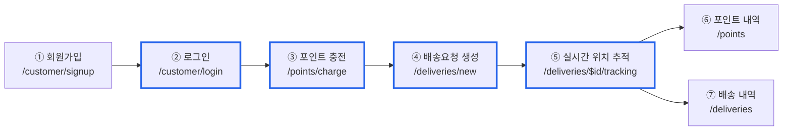
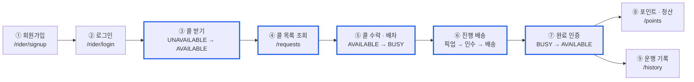
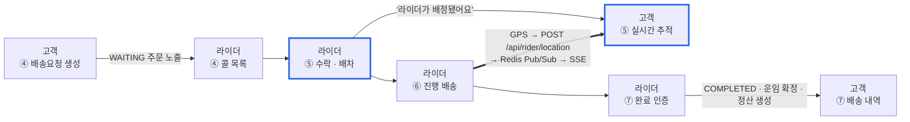
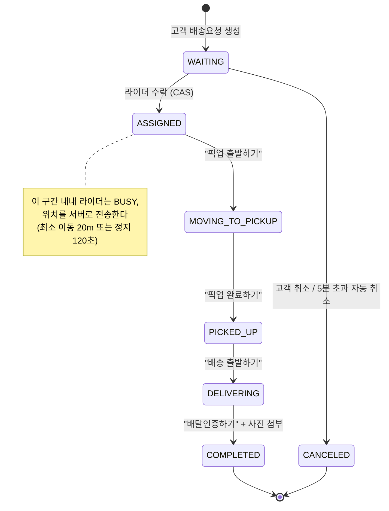

# Turkey 사용자 흐름도

> **초안입니다.** 노드 라벨·경로는 실제 라우트(`frontend/src/routes/`)와 `demo-android.js` 시연
> 순서를 대조해 작성했습니다. ADR 링크는 README에 이미 있는 5개만 실제 URL이고,
> 나머지는 `TBD-` 로 표시했습니다 — 위키 페이지가 생기면 채웁니다.

고객과 라이더가 각자 화면을 거치며 하나의 배송이 완성되기까지의 경로입니다.
**파란 테두리 노드는 클릭하면 그 지점의 의사결정 기록(ADR)으로 이동**합니다.

<br>

## 1. 고객 흐름



<br>

## 2. 라이더 흐름



<br>

## 3. 두 흐름이 만나는 지점

고객과 라이더 화면이 서버를 통해 서로를 움직이는 네 곳입니다. 여기가 이 서비스의 난이도가 몰린 구간입니다.



<br>

## 4. 배송 상태 전이 (⑥ 진행 배송 구간 상세)

`/rider/delivery` 한 화면에서 버튼으로 전이가 일어납니다. **별도 상태변경 화면은 없습니다.**



<br>

## 5. 노드 → ADR 매핑

링크는 **정책적 트레이드오프가 있었던 지점에만** 겁니다. 단순 화면 전환에는 걸지 않습니다.

| 흐름 노드 | ADR | 상태 |
| --- | --- | --- |
| ② 로그인 (고객·라이더 공통) | [ADR-002 Redis 사용](https://github.com/softeerbootcamp-8th/WEB-Team7-Turkey/wiki/ADR‐002-Redis-사용) | ✅ 있음 |
| ③ 포인트 충전 | `TBD` 포인트 충전·PG 파사드 | ⛔ 위키 페이지 필요 |
| ④ 배송요청 생성 | `TBD` 주문 생성과 포인트 차감 | ⛔ 위키 페이지 필요 |
| ⑤ 실시간 위치 추적 | [ADR-010 위치 전달 방식(SSE)](<https://github.com/softeerbootcamp-8th/WEB-Team7-Turkey/wiki/ADR‐010:-위치-전달-방식(SSE)-부하테스트-검증>) | ✅ 있음 |
| ③ 라이더 콜 받기 (상태 전이) | [ADR-003 라이더 상태와 배송 상태 분리](https://github.com/softeerbootcamp-8th/WEB-Team7-Turkey/wiki/ADR‐003-라이더-상태와-배송-상태-분리) | ✅ 있음 |
| ④ 콜 목록 조회 | `TBD` 배차 위치 검색 방향 | ⛔ 위키 페이지 필요 |
| ⑤ 콜 수락 · 배차 | [ADR-006 배차 동시성 처리](https://github.com/softeerbootcamp-8th/WEB-Team7-Turkey/wiki/ADR‐006-배차-동시성-처리) | ✅ 있음 |
| ⑦ 배송 완료 인증 | `TBD` 배송 완료와 정산 | ⛔ 위키 페이지 필요 |
| (전역) JVM 튜닝 | [ADR-011 GC 방식 비교](<https://github.com/softeerbootcamp-8th/WEB-Team7-Turkey/wiki/ADR‐011:-GC-방식-비교-부하테스트-검증(SerialGC-vs-G1GC,-N=500)>) | ✅ 있음 · 흐름도에 안 걸림 |

<br>

## 6. ADR 위키 페이지 표준 구조

흐름도에서 클릭해 들어온 사람이 **"이 결정이 왜 이렇게 됐는지"를 링크만 따라가며** 알 수 있어야 합니다.
각 ADR 페이지는 아래 순서를 지킵니다 — 본문은 짧게, 근거는 전부 링크로.

```markdown
# ADR-0XX 제목

## 한 줄 결론
조건부 UPDATE(CAS)로 배차 동시성을 처리한다.

## 어떻게 논의했나
- 💬 [디스커션 #84 배차 동시성 처리](링크)          ← 대안 비교가 여기 있다
- 💬 [디스커션 #468 배차 수락 데드락](링크)         ← 그 뒤에 터진 문제

## 무엇을 구현했나
- 🎫 [#56 배차 수락 API](링크)
- 🎫 [#446 수락 경로 데드락 해소](링크)

## 어떻게 검증했나
- 📊 [부하테스트 결과 #491](링크)
- 📈 [리포트: docs/loadtest/...](링크)

## 도식


## 트레이드오프
- 얻은 것: 락 없이 단일 배차 보장
- 잃은 것: 실패 사유 구분에 재조회 1회 추가
```

<br>

## 7. README에 넣을 위치

`## 🎬 시연 영상` 바로 다음, `## 📌 주요 기능` 앞에 넣습니다.
README에는 **1~3번(고객 · 라이더 · 접점) 세 흐름도만** 옮기고, 상태 전이도(4번)와
매핑표(5번)는 이 문서에 남겨 README가 길어지지 않게 합니다.

```markdown
## 🗺️ 사용자 흐름도

> 파란 테두리 노드를 클릭하면 그 지점의 의사결정 기록(ADR)으로 이동합니다.
> 상태 전이 상세와 전체 ADR 매핑은 [docs/06-user-flow.md](./docs/06-user-flow.md) 참고.

（1번 · 2번 · 3번 mermaid 블록）

<br>
```

<br>

## 8. 확인이 필요한 항목

- **`click ... href` 가 GitHub README에서 실제로 클릭되는지** 렌더 확인 필요. 안 되면 흐름도 아래에
  3번 매핑표를 함께 두는 방식으로 대체한다.
- **TBD 4건의 위키 페이지를 새로 쓸지, 기존 디스커션 링크로 대체할지** — 지금 있는 재료는
  충전(#32/#33/#34), 주문 생성(#37/#40), 콜 목록(디스커션 #338/#380), 완료·정산(#61/#71).
- **ADR 번호 체계가 두 가지다.** README·위키는 `ADR-002`(3자리), `docs/00-project-context.md`는
  `ADR-0002`(4자리, 프론트엔드 라우트 구조). 링크를 걸기 전에 하나로 통일해야 한다.
- 고객 회원가입(①) 진입점이 `/customer/signup` 과 `/auth/signup`(역할 선택) 두 갈래인데
  후자는 아직 스텁이다. 흐름도는 실제 동작하는 전자만 그렸다.
