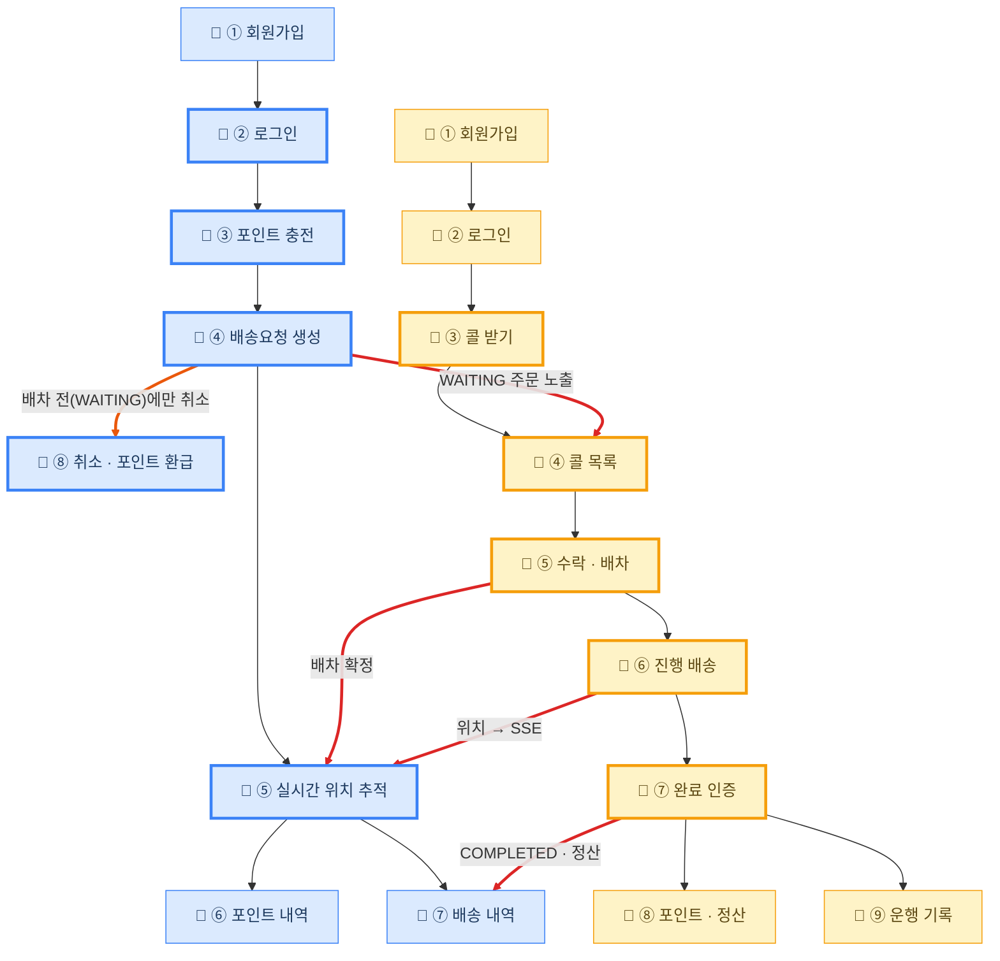
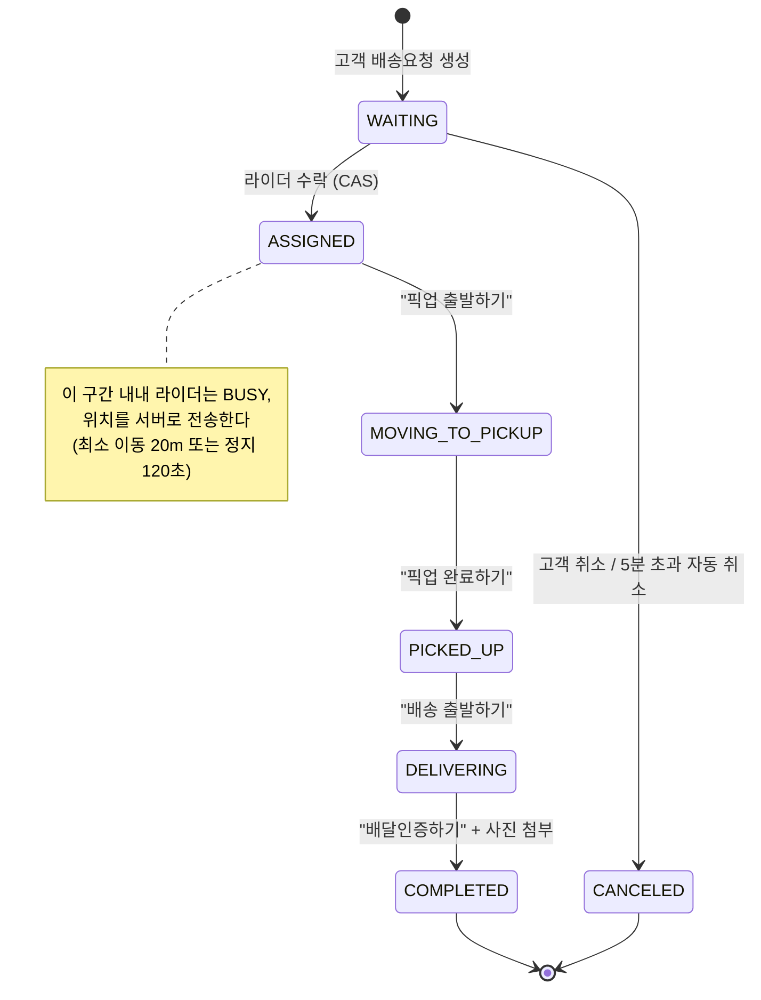

# Turkey 사용자 흐름도

> **초안입니다.** 노드 라벨·경로는 실제 라우트(`frontend/src/routes/`)와 `demo-android.js` 시연
> 순서를 대조해 작성했습니다. ADR 링크는 README에 이미 있는 5개만 실제 URL이고,
> 나머지는 `TBD-` 로 표시했습니다 — 위키 페이지가 생기면 채웁니다.

고객과 라이더가 각자 화면을 거치며 하나의 배송이 완성되기까지의 경로입니다.

<br>

## 1. 전체 흐름

| 표기 | 뜻 |
| --- | --- |
| 🟦 파란 노드 | 고객 · 웹 브라우저 |
| 🟨 노란 노드 | 라이더 · 안드로이드 앱 |
| 🔴 빨간 화살표 | 두 액터가 서버를 통해 서로를 움직이는 지점 |
| 🟠 주황 화살표 | 고객이 흐름에서 빠져나가는 분기(취소) |
| 굵은 테두리 | **클릭하면 그 지점의 의사결정 기록(ADR)으로 이동** |



노드는 화면 이름만 담았습니다. **각 화면의 라우트 경로와 걸린 ADR은 3번 표**,
**상태 전이(`UNAVAILABLE→AVAILABLE`, `WAITING→ASSIGNED` 등)는 2번 상태 전이도**를 보세요.

<br>

## 2. 배송 상태 전이 (⑥ 진행 배송 구간 상세)

`/rider/delivery` 한 화면에서 버튼으로 전이가 일어납니다. **별도 상태변경 화면은 없습니다.**



<br>

## 3. 노드 → ADR 매핑

링크는 **정책적 트레이드오프가 있었던 지점에만** 겁니다. 단순 화면 전환에는 걸지 않습니다.

| 흐름 노드 | 라우트 | ADR | 상태 |
| --- | --- | --- | --- |
| 🧑 ① 회원가입 | `/customer/signup` | — | 판단 지점 아님 |
| 🧑 ② 로그인 · 🛵 ② 로그인 | `/customer/login` · `/rider/login` | [ADR-002 Redis 사용](https://github.com/softeerbootcamp-8th/WEB-Team7-Turkey/wiki/ADR‐002-Redis-사용) | ✅ 있음 |
| 🧑 ③ 포인트 충전 | `/customer/points/charge` | `TBD` 포인트 충전·PG 파사드 | ⛔ 위키 페이지 필요 |
| 🧑 ④ 배송요청 생성 | `/customer/deliveries/new` | `TBD` 주문 생성과 포인트 차감 | ⛔ 위키 페이지 필요 |
| 🧑 ⑤ 실시간 위치 추적 | `/customer/deliveries/$id/tracking` | [ADR-010 위치 전달 방식(SSE)](<https://github.com/softeerbootcamp-8th/WEB-Team7-Turkey/wiki/ADR‐010:-위치-전달-방식(SSE)-부하테스트-검증>) | ✅ 있음 |
| 🧑 ⑥ 포인트 내역 · ⑦ 배송 내역 | `/customer/points` · `/customer/deliveries` | — | 판단 지점 아님 |
| 🧑 ⑧ 취소 · 포인트 환급 | `/customer/deliveries/$id/tracking` (WAITING일 때만) | `TBD` 고객 취소와 환급 | ⛔ 위키 페이지 필요 |
| 🛵 ③ 콜 받기 | `/rider` (UNAVAILABLE→AVAILABLE) | [ADR-003 라이더 상태와 배송 상태 분리](https://github.com/softeerbootcamp-8th/WEB-Team7-Turkey/wiki/ADR‐003-라이더-상태와-배송-상태-분리) | ✅ 있음 |
| 🛵 ④ 콜 목록 | `/rider/requests` | `TBD` 배차 위치 검색 방향 | ⛔ 위키 페이지 필요 |
| 🛵 ⑤ 수락 · 배차 | `/rider/requests/$id` (AVAILABLE→BUSY) | [ADR-006 배차 동시성 처리](https://github.com/softeerbootcamp-8th/WEB-Team7-Turkey/wiki/ADR‐006-배차-동시성-처리) | ✅ 있음 |
| 🛵 ⑥ 진행 배송 | `/rider/delivery` | [ADR-010 위치 전송·SSE 팬아웃](<https://github.com/softeerbootcamp-8th/WEB-Team7-Turkey/wiki/ADR‐010:-위치-전달-방식(SSE)-부하테스트-검증>) | ✅ 있음 |
| 🛵 ⑦ 완료 인증 | `/rider/delivery/$id/complete` (BUSY→AVAILABLE) | `TBD` 배송 완료와 정산 | ⛔ 위키 페이지 필요 |
| 🛵 ⑧ 포인트·정산 · ⑨ 운행 기록 | `/rider/points` · `/rider/history` | — | 판단 지점 아님 |
| (전역) JVM 튜닝 | — | [ADR-011 GC 방식 비교](<https://github.com/softeerbootcamp-8th/WEB-Team7-Turkey/wiki/ADR‐011:-GC-방식-비교-부하테스트-검증(SerialGC-vs-G1GC,-N=500)>) | ✅ 있음 · 흐름도에 안 걸림 |

<br>

## 4. ADR 위키 페이지 표준 구조

흐름도에서 클릭해 들어온 사람이 **"이 결정이 왜 이렇게 됐는지"를 링크만 따라가며** 알 수 있어야 합니다.
각 ADR 페이지는 아래 순서를 지킵니다 — 본문은 짧게, 근거는 전부 링크로.

```markdown
# ADR-0XX 제목

## 한 줄 결론
조건부 UPDATE(CAS)로 배차 동시성을 처리한다.

## 어떻게 논의했나
- 💬 [디스커션 #84 배차 동시성 처리](링크)          ← 대안 비교가 여기 있다
- 💬 [디스커션 #468 배차 수락 데드락](링크)         ← 그 뒤에 터진 문제

## 무엇을 구현했나
- 🎫 [#56 배차 수락 API](링크)
- 🎫 [#446 수락 경로 데드락 해소](링크)

## 어떻게 검증했나
- 📊 [부하테스트 결과 #491](링크)
- 📈 [리포트: docs/loadtest/...](링크)

## 도식


## 트레이드오프
- 얻은 것: 락 없이 단일 배차 보장
- 잃은 것: 실패 사유 구분에 재조회 1회 추가
```

<br>

## 5. README에 넣을 위치

`## 🎬 시연 영상` 바로 다음, `## 📌 주요 기능` 앞에 넣습니다.
README에는 **1번 전체 흐름도와 범례만** 옮기고, 상태 전이도(2번)와 매핑표(3번)는
이 문서에 남겨 README가 길어지지 않게 합니다.

```markdown
## 🗺️ 사용자 흐름도

> 굵은 테두리 노드를 클릭하면 그 지점의 의사결정 기록(ADR)으로 이동합니다.
> 라우트 경로·상태 전이 상세와 전체 ADR 매핑은 [docs/06-user-flow.md](./docs/06-user-flow.md) 참고.

（범례 표 + 1번 mermaid 블록）

<br>
```

<br>

## 6. 확인이 필요한 항목

- **`click ... href` 는 로컬 검증까지 끝났다** — mermaid 11 을 GitHub 과 같은 `securityLevel: strict`
  로 실제 크로미움에서 렌더해 링크 10개가 모두 `<a href>` 로 나오는 것을 확인했다. 남은 미지수는
  **GitHub 자체 sanitizer** 뿐이라, 브랜치에 올린 뒤 렌더 화면에서 한 번 눌러 보면 끝난다.
  혹시 막히면 흐름도 아래 3번 매핑표가 그대로 대체 수단이 된다.
- **TBD 5건의 위키 페이지를 새로 쓸지, 기존 디스커션 링크로 대체할지** — 지금 있는 재료는
  충전(#32/#33/#34), 주문 생성(#37/#40), 콜 목록(디스커션 #338/#380), 완료·정산(#61/#71),
  고객 취소(#47 · 디스커션 #402/#444).
- **ADR 번호 체계가 두 가지다.** README·위키는 `ADR-002`(3자리), `docs/00-project-context.md`는
  `ADR-0002`(4자리, 프론트엔드 라우트 구조). 링크를 걸기 전에 하나로 통일해야 한다.
- 고객 회원가입(①) 진입점이 `/customer/signup` 과 `/auth/signup`(역할 선택) 두 갈래인데
  후자는 아직 스텁이다. 흐름도는 실제 동작하는 전자만 그렸다.
- **서버측 자동 취소(5분 초과, `DeliveryTimeoutService`)는 흐름도에 넣지 않았다**(사람 확인,
  2026-08-13). 사용자가 하는 행동이 아니라서다. 다만 상태 전이도(2번)에는 실제 전이라서 남겼다.
